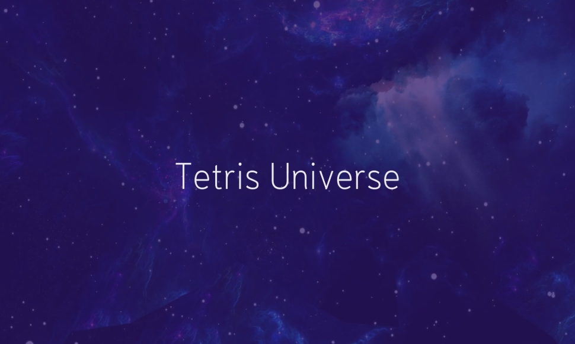

# Jogo-tetrisattack

Um projeto da escola, que tinha como objetivo refazer um jogo já existente, porém desta vez utilizando a Unity. Recriei o jogo Tetris Attack do Yoshi, colocando como nome "Tetris Universe", assim sendo o tema do jogo o universo.

# Tetris Universe

# Menu

# Tutorial

# Fase 1

# Fase 2

# Fase 3

